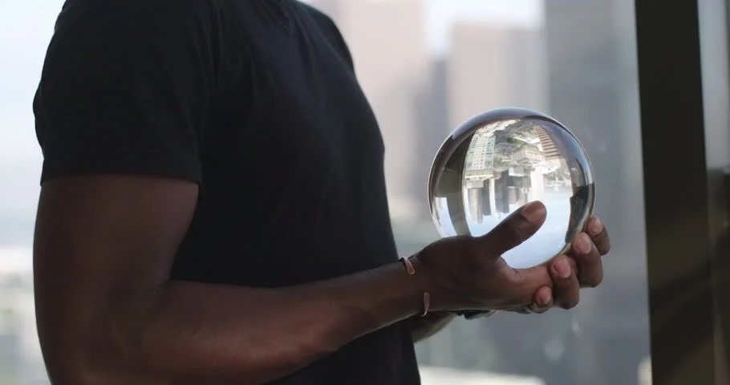

We're exploring the question "What will the web look like in 10 years?".

We believe web interfaces will start to blend with the real world, that there will be virtual actions or verbs attached to everyday objects, and that the browser as your user-agent will in some ways invert the current display architectures that we are used to. Instead of each app rendering to a separate page your user agent will arbitrate and filter many apps attempting to render to the same view.

At a foundation level this work leverages and is highly indebited to the work of many existing technologies. We're using Servo, Rust and Cargo to support durable persistent apps on the client, and as a result benefit from emerging standards such as WebGPU, WebXR, and process and filesystem sandboxing. Our interest here is supporting durable persistent first class apps within the browser; so we are creating a new persistence model for rich apps.

Beyond this we see an opportunity to make data objects into first class citizens. Public ledgers and services such as Metamask allow for self signed identity, and help reduce the need for separate accounts and passwords on each service. We also see a role for social trust graphs similar to Keybase in order to help filter and score content and to keep out bad actors. We also see https://solidproject.org/ as an important capability we want to provide.

